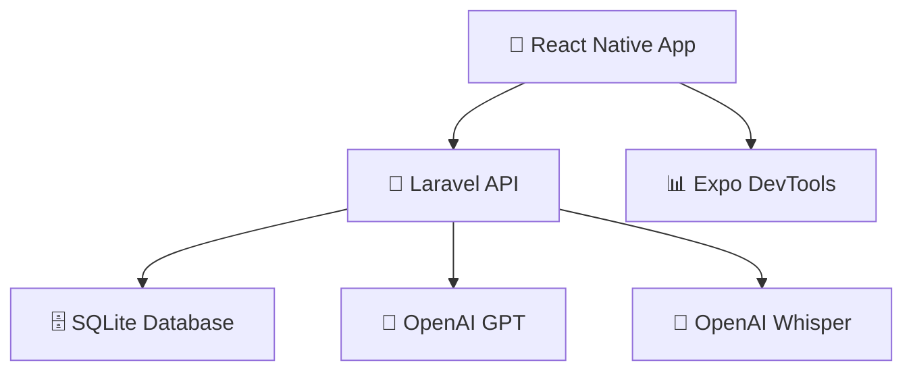

# 🌟 AURA - Compañero Digital para Adultos Mayores

<div align="center">


**Tecnología que acompaña, no complica**

[](https://opensource.org/licenses/MIT)
[](https://reactnative.dev/)
[](https://laravel.com/)
[](https://openai.com/)

</div>

## 📖 Sobre AURA

AURA es una aplicación móvil diseñada específicamente para adultos mayores que combina **inteligencia artificial conversacional** con un **diario personal digital**. Proporciona compañía, apoyo emocional y herramientas para el bienestar mental a través de una interfaz **simple, accesible y empática**.

### 🎯 Misión
Reducir la soledad en adultos mayores proporcionando un compañero digital que entiende, escucha y acompaña, respetando siempre su privacidad y dignidad.

## ✨ Características Principales

### 🤖 **Conversaciones Inteligentes**
- 💬 Chat empático optimizado para adultos mayores
- 🎭 Múltiples personalidades: General, Salud, Memoria, Entretenimiento
- 🔤 Interfaz accesible con texto grande y botones claros
- 🗑️ Eliminación segura con confirmación

### 📖 **Diario Personal con Voz**
- ✍️ Entradas de texto para pensamientos y experiencias
- 🎤 **Grabación de voz con transcripción automática** (OpenAI Whisper)
- 😊 Seguimiento de estados de ánimo con iconos intuitivos
- 📚 Historial completo de todas las entradas
- 🇪🇸 Transcripción optimizada para español y acentos latinos

### 🔐 **Privacidad y Seguridad**
- 🏠 Base de datos local SQLite (sin nube)
- 🔒 Autenticación segura con Laravel Sanctum
- 🧹 Eliminación automática de archivos temporales
- 🛡️ Encriptación de datos sensibles

## 🏗️ Arquitectura del Sistema

<div align="center">



</div>

### 🔧 Stack Tecnológico

| Componente | Tecnología | Versión |
|------------|------------|---------|
| **Frontend** | React Native + Expo | SDK 49 |
| **Backend** | Laravel | 11.x |
| **Base de Datos** | SQLite | 3.x |
| **Autenticación** | Laravel Sanctum | 4.x |
| **IA Conversacional** | OpenAI GPT | 4.0 |
| **Transcripción** | OpenAI Whisper | 1.0 |
| **Testing** | Node.js + Axios | 18.x |

## 🚀 Inicio Rápido

### 📋 Requisitos Previos

- **Node.js** 18.0+ ([Descargar](https://nodejs.org/))
- **PHP** 8.1+ ([Descargar](https://www.php.net/downloads))
- **Composer** ([Descargar](https://getcomposer.org/download/))
- **Expo CLI**: `npm install -g @expo/cli`

### ⚡ Instalación en 5 Minutos

```bash
# 1. Clonar repositorio
git clone https://github.com/tu-usuario/aura.git
cd aura

# 2. Configurar backend
cd backend
composer install
cp .env.example .env
php artisan key:generate
php artisan migrate
php artisan tinker --execute="App\Models\User::create(['name' => 'Test User', 'email' => 'admin@aura.com', 'password' => bcrypt('password')]);"

# 3. Configurar frontend
cd ../mobile
npm install

# 4. Configurar tests
cd ../tests
npm install
```

### 🏃‍♂️ Ejecutar la Aplicación

```bash
# Terminal 1: Backend
cd backend
php artisan serve --host=127.0.0.1

# Terminal 2: Frontend
cd mobile
npx expo start --port 8083

# Terminal 3: Tests (opcional)
cd tests
npm test
```

### 📱 Conectar Dispositivo

1. Instala **Expo Go** desde [App Store](https://apps.apple.com/app/expo-go/id982107779) o [Google Play](https://play.google.com/store/apps/details?id=host.exp.exponent)
2. Escanea el código QR desde Expo DevTools
3. Inicia sesión con: `admin@aura.com` / `password`

## 📚 Documentación Completa

| Documento | Descripción |
|-----------|-------------|
| 📖 **[Guía de Instalación](docs/SETUP.md)** | Configuración detallada paso a paso |
| 🌟 **[Características](docs/FEATURES.md)** | Descripción completa de funcionalidades |
| 🔌 **[API Reference](docs/API.md)** | Documentación completa de endpoints |
| 🧪 **[Testing Guide](tests/README.md)** | Guía de pruebas y debugging |

## 🧪 Suite de Pruebas

El proyecto incluye pruebas automatizadas para garantizar la calidad:

```bash
cd tests

# Verificar salud de la API
npm run test:api

# Probar eliminación de conversaciones
npm run test:conversations

# Probar funcionalidad del diario
npm run test:diary

# Ejecutar todas las pruebas
npm test
```

## 🔧 Configuración Avanzada

### Variables de Entorno

Crear `backend/.env` con:

```env
# Aplicación
APP_NAME=AURA
APP_ENV=local
APP_DEBUG=true

# Base de datos
DB_CONNECTION=sqlite
DB_DATABASE=/ruta/absoluta/a/database.sqlite

# OpenAI (requerido para transcripción)
OPENAI_API_KEY=tu-clave-openai-aqui
```

### Configuración para Dispositivo Físico

1. Encuentra tu IP local: `ipconfig` (Windows) o `ifconfig` (Mac/Linux)
2. Actualiza `mobile/src/services/apiService.js`:
   ```javascript
   const BASE_URL = 'http://TU-IP-LOCAL:8000/api';
   ```

## 📊 Estructura del Proyecto

```
AURA/
├── 📱 mobile/              # React Native + Expo
│   ├── src/
│   │   ├── components/     # Componentes reutilizables
│   │   ├── screens/        # Pantallas principales
│   │   ├── services/       # API y servicios
│   │   └── context/        # Estado global
│   └── package.json
├── 🔧 backend/             # Laravel API
│   ├── app/
│   │   ├── Http/           # Controllers y Middleware
│   │   └── Models/         # Modelos Eloquent
│   ├── database/           # Migraciones y Seeders
│   └── routes/api.php      # Rutas de la API
├── 🧪 tests/               # Suite de pruebas
│   ├── api-health.test.js
│   ├── conversation-deletion.test.js
│   └── diary-entries.test.js
├── 📚 docs/                # Documentación
│   ├── SETUP.md
│   ├── FEATURES.md
│   └── API.md
└── README.md
```

## 🔮 Roadmap

### 🎯 Próximas Características

- [ ] 💊 **Recordatorios de medicamentos** con notificaciones inteligentes
- [ ] 📹 **Videollamadas familiares** integradas
- [ ] 🧠 **Juegos cognitivos** para ejercitar la mente
- [ ] 📊 **Integración con dispositivos de salud** (tensiómetros, glucómetros)
- [ ] 📴 **Modo offline** para funcionalidad básica
- [ ] 👨‍👩‍👧‍👦 **Panel familiar** para cuidadores
- [ ] 📈 **Análisis de patrones** emocionales y de salud
- [ ] 🗣️ **Asistente de voz** siempre activo

### 🎨 Mejoras de Accesibilidad

- [ ] 🌍 **Soporte multiidioma** (inglés, portugués)
- [ ] 🎨 **Personalización de UI** (fuentes, colores, contraste)
- [ ] 🔊 **Integración con audífonos** Bluetooth
- [ ] 🎙️ **Comandos de voz** para navegación
- [ ] 🧠 **Modo simplificado** para usuarios con demencia

## 🤝 Contribuir

¡Las contribuciones son bienvenidas! Por favor:

1. 🍴 Fork el proyecto
2. 🌿 Crea una rama: `git checkout -b feature/nueva-caracteristica`
3. 💾 Commit: `git commit -m 'Agregar nueva característica'`
4. 📤 Push: `git push origin feature/nueva-caracteristica`
5. 🔄 Abre un Pull Request

### 📝 Guías de Contribución

- Sigue las convenciones de código existentes
- Incluye tests para nuevas características
- Actualiza la documentación según sea necesario
- Usa commits descriptivos en español

## 🐛 Solución de Problemas

### Problemas Comunes

| Problema | Solución |
|----------|----------|
| 🔌 Expo no se conecta | `npx expo start --port 8083 --clear --tunnel` |
| 🚫 Error de CORS | Verificar `--host=127.0.0.1` en Laravel |
| 🗄️ Base de datos no existe | `touch database/database.sqlite && php artisan migrate` |
| 🤖 OpenAI no funciona | Verificar `OPENAI_API_KEY` en `.env` |

### 📞 Obtener Ayuda

1. 📖 Consulta la [documentación](docs/)
2. 🧪 Ejecuta las [pruebas](tests/) para diagnosticar
3. 🐛 Abre un [issue](https://github.com/tu-usuario/aura/issues) en GitHub

## 📄 Licencia

Este proyecto está licenciado bajo la **Licencia MIT** - ver el archivo [LICENSE](LICENSE) para más detalles.

## 👥 Equipo

Desarrollado con ❤️ para mejorar la calidad de vida de nuestros adultos mayores.

### 🙏 Agradecimientos

- **OpenAI** por las APIs de GPT y Whisper
- **Laravel** por el excelente framework
- **Expo** por simplificar el desarrollo móvil
- **Comunidad de código abierto** por las herramientas increíbles

---

<div align="center">

**AURA - Porque la tecnología debe acompañar, no complicar** 🌟

[](https://github.com/tu-usuario/aura)
[](https://github.com/tu-usuario/aura/issues)
[](https://github.com/tu-usuario/aura/issues)

</div>
